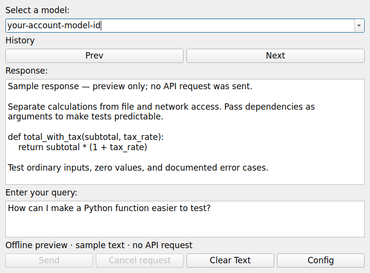

# AI Pair Programmer

[](https://github.com/Monotoba/ai-pair-programmer/actions/workflows/tests.yml)


[](https://github.com/Monotoba/ai-pair-programmer/releases/tag/v0.1.0a1)
[](LICENSE.md)

An experimental PyQt5 desktop assistant for asking programming questions,
viewing responses, and browsing local query history.

**Work in progress:** the OpenAI integration uses the Responses API and an
editable model ID. Request/response behavior is covered by offline tests, but
live API functionality has not been validated. JSON history and session-only
keys are implemented. The published `0.1.0a1` experimental alpha has offline Qt and package
validation; interactive desktop checks remain pending.

## What is implemented

- Query and response text panes with a saved, editable model ID.
- Local history with previous/next navigation.
- Session-only API-key configuration and saved model settings.
- Clear text without deleting history.
- Background requests, duplicate-submission protection, and local cancellation.

## Desktop preview



This is the actual Qt interface rendered offscreen with sample text. No API
request was sent. The disabled Send button is specific to the preview script.

## Install the alpha

Download the wheel and `SHA256SUMS.txt` from the
[0.1.0a1 prerelease](https://github.com/Monotoba/ai-pair-programmer/releases/tag/v0.1.0a1).
Use Python 3.10+ in an activated virtual environment, then run:

```sh
python -m pip install aipairprogrammer-0.1.0a1-py3-none-any.whl
python -m aipairprogrammer
```

This alpha is for testing and feedback. PyPI publication remains on hold.

## Developer quick start

Requires Python 3.10+ and a graphical desktop. Linux, macOS, and Windows
have an offline CI matrix; automated Qt tests use offscreen rendering.

```sh
git clone https://github.com/Monotoba/ai-pair-programmer.git
cd ai-pair-programmer
python -m venv .venv
```

Activate with `source .venv/bin/activate` on Linux/macOS, or
`.venv\Scripts\Activate.ps1` in Windows PowerShell, then:

```sh
python -m pip install -e ".[test]"
python -m aipairprogrammer
```

The installed `ai-pair-programmer` command and `python main.py` also launch
the app. Opening the GUI does not send a request; clicking Send does.

## API configuration

Enter a Responses-compatible model ID available to your API account in the
editable model field. No model is chosen automatically; existing saved IDs
are preserved, so replace any historical ID before sending a request.

Prefer setting `OPENAI_API_KEY` in the process environment. It takes precedence
over a key entered in **Config** and is not copied into the settings file.
The SDK is explicitly directed to `https://api.openai.com/v1`; this app does
not support custom API endpoints. Sending a query may incur API charges.
Requests set `store=False`; this is not a guarantee of zero provider retention.
Only completed, non-empty text responses are added to local history.

## Data and limitations

Settings and validated JSON history are stored in a per-user data directory.
Keys entered in **Config** are kept in memory for the current session only;
`settings.ini` saves only the model ID. Queries and responses remain private
local data in `history.json`. Writes use atomic replacement to protect existing
files if a write fails. Unreadable history is preserved and saving is blocked.

Existing working-directory `settings.ini` and pickle `history.dat` files are
left untouched and are not imported automatically. Re-enter your model and
set an environment or session key when upgrading. See the
[user guide](docs/USERGUIDE.md#upgrading-from-legacy-storage) for paths and history
migration limitations.

Requests run in a worker thread so the interface remains responsive.
Only one request may run at a time. **Cancel request** discards its eventual
result locally; it does not guarantee cancellation at OpenAI or avoid charges.
Send stays disabled until the request finishes, and closing the window waits
for the worker to finish safely. History contains independent queries, not
conversational sessions. Requests use a
30-second SDK timeout with automatic retries disabled. No live API request,
billing, or model availability is exercised by the automated tests.

See the [user guide](docs/USERGUIDE.md), [roadmap](docs/ROADMAP.md), and
[contributor instructions](CONTRIBUTING.md). Specific bug reports and small
pull requests are welcome, especially for the roadmap items.

Licensed under [BSD-2-Clause](LICENSE.md).
